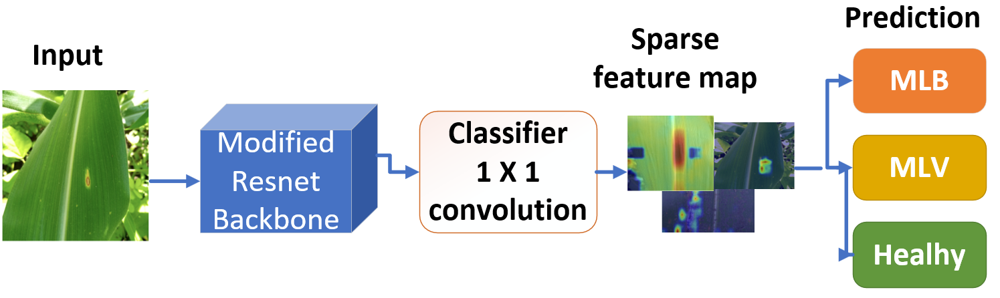

# Towards Efficient and Self-Explainable Plant Disease Detection in Agriculture Using Sparse BagNet and Post-TrainingQuantization

A comparative study of **ResNet-50**, **dense BagNet** and **sparse BagNet** for maize disease classification, with post-training quantization (INT8), Grad-CAM explainability, and noise robustness analysis.


## Model's architecture



## Classes
| Label | Disease |
|---|---|
| `Healthy` | Healthy plant |
| `MLB` | Maize Lethal Blight |
| `MSV` | Maize Streak Virus |

## Results summary

| Model         |                           | Precision (%)              | Accuracy (%)                | Size (MB)                        | 
|---------------|---------------------------|----------------------------|-----------------------------|----------------------------------|
| ResNet-50     | FP32  <br/> FP16<br/>INT8 | 99.83<br/>99.83<br/>95.10  | 99.83<br/>99.83<br/>94.40   | 90.00<br/>45.04<br/>22.98        | 
| dense Bagnet  | FP32  <br/> FP16<br/>INT8 | 98.32<br/> 98.30<br/>92.75 | 98.32<br/>98.27<br/>91.91   | 62.36<br/>31.23<br/>16.08        | 
| sparse Bagnet | FP32  <br/> FP16<br/>INT8 | 98.40<br/> 98.45<br/>91.00 | 98.40<br/> 98.44<br/> 91.11 | 62.36<br/>31.23<br/>16.08        |

---

## Project structure
```
│
├── configs/
│   └── config.yaml            # Hyperparameters, paths, device settings
├── data/
│   ├── dataset.py        
│   ├── dataset_sensitivity.py            
│   └──  ...
├── models/
│   ├── resnet.py          # ResNet-50 model 
│   ├── bagnet.py          # BagNet-33 model 
│   │
│   ...
│
├── quantization/
│   ├── ptq_bagnet.py      # Static INT8 Post training quantization
│   ├── ptq_resnet.py      # Static INT8 Post training quantization
│   └── quantize.py
│
│
├── results/                   # Saved plots and model checkpoints (gitignored)
├── utils/
│   ├── gradcam_fp32_fp16.py         # GradCAM (FP32/FP16) 
│   ├── gradcam_int8.py          # GradCAM-INT8
│   ├── metrics.py              # accuracy, ROC-AUC, classification report
│   │
│   ...
│
│
├── main.py   fine-tuning + Evaluation + INT8 quantization + 
├── train.py  fine-tuning 
├── requirements.txt
└── README.md
```

## Dependencies
All packages required for running the code in the repository are listed in the file `requirements.txt`

---

## Installation

```bash
git clone https://github.com/bonoubaeudes/efficient-self-explainable.git
cd maize_disease_classification
pip install -r requirements.txt

# BagNet dependency
git clone https://github.com/wielandbrendel/bag-of-local-features-models.git
pip install -e bag-of-local-features-models/
```

## Quick start

### 1. Configure paths
Edit `configs/config.yaml` to set your dataset path.

### 2. Train/Evaluate/Quantization
```bash
python main.py
```


---

## Key techniques
- **Static INT8 quantization** via `torch.ao.quantization` (FX graph mode for ResNet, eager mode for BagNet)
- **Grad-CAM** adapted for FP32, FP16, and INT8 models
- **Sensitivity analysis**: progressive region masking to measure explanation faithfulness
- **Noise robustness sweep**: Gaussian / salt-and-pepper / uniform noise across precision variants

---

## Dataset
[Maize Disease Dataset](https://doi.org/10.7910/DVN/LPGHKK)

## License
MIT